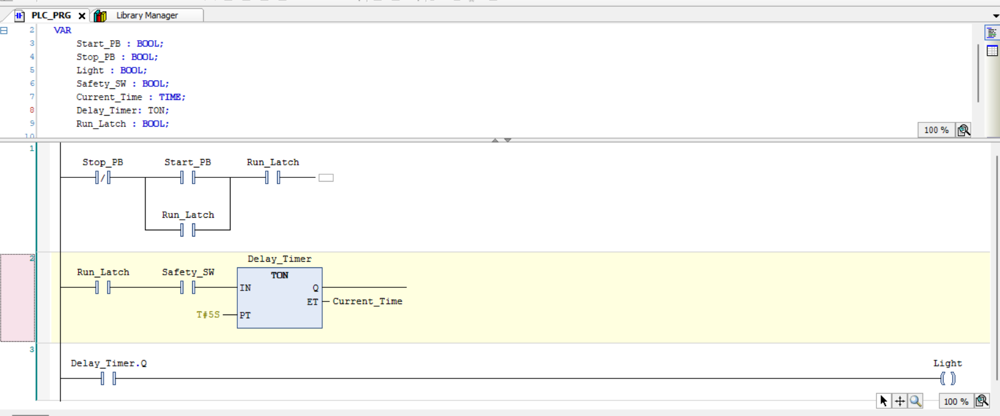
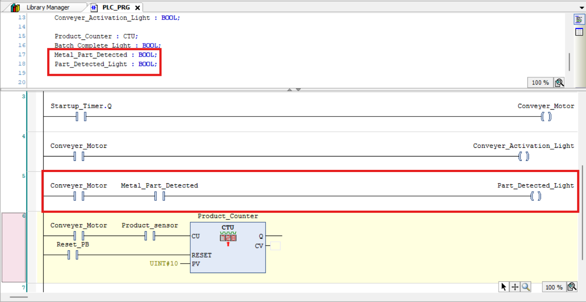
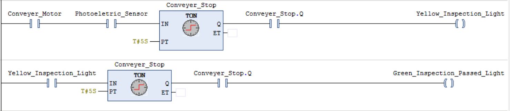

# PLC Project 1 – Conveyer Belt Project

## Overview

This project is the first step in my PLC programming journey using CODESYS.

The goal is to understand the fundamentals of PLC programming by creating a simple program where pressing a push button energizes an output to turn on a light.

---

## Skills Practiced

- PLC Fundamentals
- Ladder Logic
- Normally Open Contact
- Output Coil
- PLC Scan Cycle

---

## Learning Objectives

- Understand how PLC inputs and outputs work
- Learn how Ladder Logic executes
- Create my first functioning PLC program
- Document my progress professionally

---

## Future Improvements

- Add a Stop button (complete)
- Add a latch circuit (complete)
- Add timers (complete)
- Convert the project to a Factory I/O simulation (complete)

---

## PLC Project 1 – Conveyer Belt Project

Objective

Design a ladder logic program in CODESYS that controls a light using a Start push button, Stop push button, Safety Switch, and a 5-second ON-delay timer. The program should use an internal latch so the Start button only needs to be pressed once.

Components Used

Inputs

- Start Push Button (NO)
- Stop Push Button (NC)
- Safety Switch (NO)

Internal Memory

- Run_Latch

- Function Block

- TON (On Delay Timer)

Output

- Light

## Program Logic

1. Pressing the Start button sets the Run_Latch memory bit.
2. Run_Latch remains TRUE after the Start button is released.
3. If the Stop button is pressed, Run_Latch resets.
4. When Run_Latch and Safety Switch are TRUE, the TON timer begins counting.
5. After 5 seconds, the timer's Q output becomes TRUE.
6. The Light output turns ON.

## What I learned

- Difference between Normally Open and Normally Closed contacts.
- Series contacts create AND logic.
- Parallel branches create OR logic.
- TON timers delay an output instead of immediately energizing it.
- nternal memory bits are used instead of output coils for latching.
- Ladder logic executes from left to right and the PLC scans continuously.

## Problems Encountered


- Problem 1

I initially didn't understand how to create a second contact in series.

Solution

Learned how ladder logic is constructed and how contacts are placed one after another.

- Problem 2

I didn't understand how TON worked.

I originally thought the timer directly delayed electricity.

Solution

Learned that TON waits until its preset time has elapsed before its Q output becomes TRUE.

- Problem 3

I didn't understand why the Stop button should use a Normally Closed contact.

Solution

Learned that industrial stop buttons are normally closed because the circuit remains complete until the button is pressed.

## Reflection

This project introduced me to the fundamentals of PLC programming using ladder logic. At first, I focused mainly on making the circuit work, but I later realized that a working program is not always the best design. My original solution latched the Light output directly, which required holding the Start button until the timer finished. After redesigning the program with an internal Run_Latch memory bit, I better understood how industrial PLC programs separate machine state, timing, and outputs into multiple rungs. This project also improved my understanding of timers, parallel branches, normally closed contacts, and troubleshooting ladder logic. Going forward, I want to build programs that are not only functional but also easier to maintain and troubleshoot.



# Version 2 – Product Counting System
## Objective

Design and program a PLC-controlled conveyor belt system that safely starts after a five-second delay, counts products using a simulated sensor, and indicates when a batch of ten products has been completed.

## Components Used

Inputs

- Start_PB – Starts the conveyor system.
- Stop_PB – Stops the conveyor system.
- Safety_SW – Prevents the conveyor from starting unless the safety switch is active.
- Product_Sensor – Detects products moving past the sensor and increments the counter.
- Reset_PB – Resets the product counter to begin a new batch.

Internal Memory / Function Blocks

- Conveyor_Run_Latch (BOOL) – Keeps the conveyor running after the Start button is released.
- Startup_Timer (TON) – Delays conveyor startup by 5 seconds.
- Product_Counter (CTU) – Counts products detected by the sensor until the preset value is reached.

Outputs
- Conveyor_Motor – Runs the conveyor after the startup delay has elapsed.
- Batch_Complete_Light – Turns ON after ten products have been counted.

## Program Logic

1. After the timer finishes, the conveyor motor turns ON.
2. As products pass the Product_Sensor, the CTU counter increments by one.
3. When the counter reaches the preset value of 10, the Batch_Complete_Light turns ON.
4. The operator presses Reset_PB to clear the counter and begin a new production batch.

## What I Learned

- How to create and use a TON (On-Delay Timer).
- How to implement a CTU (Count Up Counter).
- The difference between a contact and a coil in ladder logic.
- ow PLC function blocks store information internally.
- The purpose of PV (Preset Value), CV (Current Value), and Q in a counter.
- Why internal variables such as Conveyor_Run_Latch are useful.
- How multiple rungs work together to create an industrial control sequence.

## Problems Encountered

- Problem 1 – Understanding Contacts vs. Coils

At first, I thought the conveyor motor should always be represented as a coil. I later learned that the coil writes to the variable, while contacts read the current state of that same variable elsewhere in the program.

- Problem 2 – Counter Data Type

Initially, I entered the preset value as a regular number. I learned that the CTU function block expects the correct data type (such as UINT) for the preset value.

- Problem 3 – Counter Placement

I was unsure whether the counter should be placed within the timer logic or on its own rung. I learned that each rung should have a single responsibility, making the program easier to read and troubleshoot.

## Reflection

This project helped me understand how timers and counters are used together in industrial automation. Instead of creating isolated examples, I expanded my original delayed-start project into a conveyor belt control system, making the program more realistic. I also developed a better understanding of PLC scan logic, function blocks, and the importance of organizing ladder logic into clear, modular rungs. In the next version of the project, I plan to improve operator feedback by adding status indicators and additional safety features.


## Version 3 - Industrial Sensor Simulation 

### Objective
Simulate an inductive proximity sensor detecting a metal object on the conveyor.

### Inputs
- Metal_Part_Detected (BOOL)

### Outputs
- Part_Detected_Light

### Program Logic
When the conveyor motor is running and a metal part is detected, the green indicator light turns on to show that the object has been successfully detected.

### Why This Is Used
In industry, proximity sensors automatically detect parts without physical contact. The PLC uses this information to make decisions such as counting products, stopping conveyors, or activating other equipment.

### What I Learned
- How a digital sensor acts as a PLC input.
- How multiple conditions can be combined using series contacts.



## Version 4 – Photoelectric Inspection System

### Objective

Expand the conveyor belt automation system by integrating a photoelectric sensor that simulates an automated inspection station. When a product reaches the inspection point while the conveyor is running, the PLC performs a timed inspection sequence before indicating that the product has successfully passed inspection.

### Components Used (Including past variant variables)

#### Inputs

- Start_PB – Starts the conveyor system.
- Stop_PB – Stops the conveyor system.
- Safety_SW – Prevents the conveyor from starting unless the safety switch is active.
- Product_Sensor – Counts products moving along the conveyor.
- Metal_Part_Detected – Simulates an inductive proximity sensor detecting a metal component.
- Photoelectric_Sensor – Detects when a product reaches the inspection station.
- Reset_PB – Resets the product counter.

#### Internal Memory / Function Blocks

- Conveyor_Run_Latch (BOOL) – Keeps the conveyor running after the Start button is released.
- Startup_Timer (TON) – Delays conveyor startup by 5 seconds.
- Product_Counter (CTU) – Counts products until the preset batch size is reached.
- Inspection_Timer (TON) – Delays the inspection process after a product is detected.
- Inspection_Passed_Timer (TON) – Delays the completion signal before indicating the inspection has passed.

#### Outputs

- Conveyor_Motor – Runs the conveyor.
- Conveyor_Activation_Light – Indicates the conveyor is operating.
- Part_Detected_Light – Turns ON when the inductive proximity sensor detects a metal part.
- Yellow_Inspection_Light – Indicates that a product is currently being inspected.
- Green_Inspection_Passed_Light – Indicates that the inspection sequence has successfully completed.
- Batch_Complete_Light – Turns ON after ten products have been counted.

### Program Logic

1. The operator presses **Start_PB** to start the conveyor system.
2. The **Startup_Timer** delays the conveyor motor for five seconds.
3. Once the timer finishes, the **Conveyor_Motor** and **Conveyor_Activation_Light** turn ON.
4. The inductive proximity sensor (**Metal_Part_Detected**) detects metal components and activates the **Part_Detected_Light**.
5. When the conveyor is running and the **Photoelectric_Sensor** detects a product, the **Inspection_Timer** begins counting.
6. After five seconds, the timer's **Q** output activates the **Yellow_Inspection_Light**, indicating that inspection is taking place.
7. A second timer (**Inspection_Passed_Timer**) begins once the yellow inspection light is active.
8. After the second timer finishes, the **Green_Inspection_Passed_Light** turns ON to indicate that the inspection has successfully completed.
9. The **Product_Counter** continues counting products until the preset batch size is reached.

### What I Learned

- How a photoelectric sensor is used as a PLC digital input.
- The difference between an inductive proximity sensor and a photoelectric sensor.
- How multiple TON timers can be connected to create a sequential machine operation.
- How timer **Q** outputs are used to trigger later stages of a process.
- How industrial inspection stations can be simulated using PLC ladder logic.
- Why descriptive variable names make ladder logic easier to understand and troubleshoot.

### Problems Encountered

#### Problem 1 – Undefined Variables

Initially, the PLC would not compile because new variables such as **Photoelectric_Sensor**, **Yellow_Inspection_Light**, and **Green_Inspection_Passed_Light** had not been declared.

**Solution:** I added the missing BOOL variables before rebuilding the project.

#### Problem 2 – Using the Wrong Timer Output

Initially, I attempted to activate the inspection light without using the timer's **Q** output.

**Solution:** I learned that the timer's **Q** output only becomes TRUE after the timer finishes counting, allowing the inspection sequence to occur after the intended delay.

#### Problem 3 – Selecting the Correct Sensor

At first, I was unsure whether to use an inductive proximity sensor or a photoelectric sensor for detecting products.

**Solution:** I learned that photoelectric sensors are better suited for detecting packages and products, while inductive proximity sensors are designed specifically for detecting metal objects.

### Reflection

This version expanded the conveyor project beyond simple product detection by simulating an automated inspection station. By combining photoelectric sensing with multiple TON timers, I created a sequential inspection process similar to those used in industrial manufacturing. This project improved my understanding of PLC sequencing, digital sensors, and organizing ladder logic into logical stages that are easier to read, troubleshoot, and expand.



## Interlock & Fault Analysis

### Hazard / Failure 1 – Safety Condition Lost

**Problem:**
The conveyor should not operate when the required safety condition is not satisfied.

**Required Response:**
Prevent the conveyor from running.

**Control Method:**
Safety interlock.

---

### Failure 2 – Motor Fault

**Problem:**
The conveyor motor develops a fault while operating.

**Required Response:**
Stop/prevent conveyor operation and notify the operator.

**Control Method:**
Logic interlock + fault indication.

---

### Failure 3 – Invalid Sensor State

**Problem:**
A product sensor detects an object when the conveyor is not running.

**Required Response:**
Detect the abnormal condition and generate a sensor fault.

**Control Method:**
PLC diagnostic logic.

---

### Failure 4 – Fault Recovery

**Problem:**
The conveyor should not automatically restart after a fault.

**Required Response:**
Require the fault to be cleared and manually reset before restarting.

**Control Method:**
Fault latch + reset logic.

# Version 5 - Industrial Fault & Interlock System

## Objective

Expand the conveyor automation system by adding simulated industrial equipment faults and interlocks. The system should detect abnormal conditions, prevent unsafe or unwanted operation, stop affected equipment, and provide operator indications for fault and reset conditions.

---

## Fault Handling System

### Failure 1 - Motor Fault

#### Problem

The conveyor motor develops a simulated fault such as an overheat condition while the conveyor is operating.

#### Input

- Motor_Overheat (BOOL) - Simulates a motor overheat/fault condition.
- Motor_E_Stop (BOOL) - Simulates an emergency-stop condition affecting the motor.
- Motor_Reset_PB (BOOL) - Allows the operator to request a manual reset.

#### Outputs

- Motor_Stop_Indication (BOOL) - Indicates that the motor has been stopped because of a fault.
- Motor_Reset_Indication (BOOL) - Indicates that the reset command has been activated.

#### Program Logic

1. The PLC monitors the motor fault conditions.
2. When a motor fault occurs, the motor is prevented from continuing normal operation.
3. The PLC activates the Motor_Stop_Indication to notify the operator.
4. The operator must address the fault before attempting a reset.
5. The operator presses Motor_Reset_PB.
6. The PLC activates Motor_Reset_Indication to provide feedback that the reset command has been received.

#### Control Method

- Logic interlock
- Fault indication
- Manual reset

---

## Failure 2 - Conveyor Fault

### Problem

The conveyor develops a simulated fault while operating.

### Input

- Conveyor_Fault (BOOL) - Simulates a conveyor equipment failure.

### Output

- Conveyor_Fault_Indication (BOOL) - Indicates that a conveyor fault has occurred.

### Program Logic

1. The PLC monitors the Conveyor_Fault signal.
2. When Conveyor_Fault becomes active, normal conveyor operation is prevented.
3. The PLC activates Conveyor_Fault_Indication.
4. The operator is notified that the conveyor requires attention.
5. The fault must be cleared before normal operation can resume.

### Control Method

- Logic interlock
- Fault indication
- Manual recovery

---

## Failure 3 - Safety Interlock

### Problem

The conveyor should not operate when the required safety condition is not satisfied.

### Input

- Safety_SW (BOOL) - Represents the required safety condition.

### Required Response

- Prevent the conveyor from starting when the safety condition is not satisfied.
- Stop/prevent operation if the safety condition is lost.

### Control Method

- Safety interlock
- Permissive condition

### Why This Is Used

Industrial machines use interlocks and permissives to prevent equipment from operating when required conditions are not satisfied.

---

## Fault and Operator Feedback

The project now contains separate indications for different abnormal conditions.

### Motor Fault

```text
[ Motor_Overheat ] --------------------( Motor_Stop_Indication )

Fault Detected
      ↓
Interlock Activated
      ↓
Equipment Stopped
      ↓
Fault Indication
      ↓
Operator Investigates Fault
      ↓
Fault Cleared
      ↓
Manual Reset
      ↓
Reset Indication
      ↓
Restart Permissive
      ↓
Normal Operation

## Problems Encountered

### Problem 1 - Understanding Fault Logic

Initially, I was unsure how a simulated equipment fault should connect to the rest of the conveyor program.

I learned that the fault system has two major purposes:

- Prevent equipment from operating when a fault is active.
- Tell the operator that a fault has occurred.

### Problem 2 - Separating Control and Diagnostics

I initially thought that the fault indication and equipment shutdown needed to be handled by the same rung.

I learned that industrial PLC programs can separate:

- Equipment control
- Interlocks
- Fault detection
- Operator indications
- Reset and recovery logic

This makes the program easier to troubleshoot and expand.

### Problem 3 - Understanding Fault Recovery

I learned that simply removing a fault signal does not necessarily mean that equipment should immediately restart.

A more realistic control system can require:

- The fault to be cleared.
- The operator to perform a manual reset.
- All restart permissives to be satisfied.

Only after these conditions are satisfied should normal operation resume.

## Version 6 - Motor Temperature Monitoring and Alarm System

### Objective

Improve the conveyor automation system by replacing the previous manually activated motor overheat fault with a simulated motor temperature measurement. The PLC now evaluates the motor temperature and automatically generates a warning or fault when defined temperature limits are reached. The temperature conditions are also connected to the existing CODESYS alarm management and HMI system.

---

### Components Used

#### Inputs / Simulated Process Values

- Motor_Temperature (REAL) – Simulates the measured temperature of the conveyor motor.

#### Internal Memory / Function Blocks

- Motor_Temp_Warning (BOOL) – Becomes TRUE when the motor temperature reaches the warning threshold.
- Motor_Overtemp_Fault (BOOL) – Becomes TRUE when the motor temperature reaches the overtemperature shutdown threshold.

#### Existing Components Used

- Conveyor_Motor – Conveyor motor output.
- Conveyor_Run_Latch – Maintains the conveyor's running state.
- CODESYS Alarm Management – Handles the warning and error conditions.
- HMI Visualization – Displays the motor temperature and alarm information.

---

### Temperature Limits

- Below 60°C – Normal operating condition.
- 60°C or higher – High temperature warning.
- 70°C or higher – Overtemperature fault and motor shutdown.

---

### Program Logic

1. The simulated `Motor_Temperature` value represents the current motor temperature.
2. When `Motor_Temperature` reaches 60°C, `Motor_Temp_Warning` becomes TRUE.
3. `Motor_Temp_Warning` is connected to the existing CODESYS warning alarm.
4. The HMI displays a motor temperature warning to the operator.
5. When `Motor_Temperature` reaches 70°C, `Motor_Overtemp_Fault` becomes TRUE.
6. `Motor_Overtemp_Fault` is used as an interlock to prevent the conveyor motor from operating.
7. The existing CODESYS error alarm is triggered by `Motor_Overtemp_Fault`.
8. The HMI displays an overtemperature error to the operator.
9. The motor remains stopped while the overtemperature fault condition is active.
10. The system was tested at different temperature values to verify that the warning and shutdown thresholds operated correctly.

---

### Example Operating Conditions

```text
25°C
↓
Normal Operation
No Warning
No Fault
Motor Allowed to Run

### Alarm Integration

#### Warning Alarm

- Condition: `Motor_Temp_Warning = TRUE`
- Alarm Class: `Warning`
- HMI Message: `Motor Temperature High`
- Purpose: Warns the operator that the motor is approaching an abnormal temperature.

#### Error Alarm

- Condition: `Motor_Overtemp_Fault = TRUE`
- Alarm Class: `Error`
- HMI Message: `Motor Overtemperature - Motor Shutdown`
- Purpose: Indicates that the motor has exceeded the permitted temperature and has been stopped.

---

### What I Learned

- How to use a `REAL` variable to represent a continuously changing physical measurement.
- How comparison logic can turn an analog-style measurement into BOOL conditions.
- How a temperature threshold can automatically generate a PLC warning.
- How a second temperature threshold can generate a shutdown fault.
- How a process measurement can be used as a PLC interlock.
- How existing CODESYS alarm management can be reused for new fault conditions.
- How HMI alarms can display the results of PLC diagnostic logic.
- The difference between a warning condition and a shutdown condition.
- How testing different process values can verify PLC fault logic.

---

### Problems Encountered

#### Problem 1 - Simulating Temperature

Initially, the motor overheat condition was represented by a manually activated BOOL.

**Solution:**

I replaced the manual fault input with a `REAL` motor temperature value so that the PLC could determine whether the motor was overheating based on its measured temperature.

#### Problem 2 - Connecting Temperature to the Existing Alarm System

Initially, the new temperature logic was separate from the alarm system.

**Solution:**

I connected `Motor_Temp_Warning` to the existing warning alarm and `Motor_Overtemp_Fault` to the existing error alarm instead of creating a completely separate alarm system.

#### Problem 3 - Connecting the Fault to Motor Shutdown

The temperature measurement needed to do more than display a warning.

**Solution:**

The `Motor_Overtemp_Fault` condition was incorporated into the conveyor control logic as an interlock so that the motor cannot continue operating when the overtemperature condition is active.

---

### Reflection

This version made the conveyor system significantly more realistic by replacing a manually activated motor fault with a simulated physical measurement. The PLC now determines when the motor temperature becomes abnormal and responds differently depending on the severity of the condition.

The project now demonstrates a complete chain from a simulated process measurement to PLC decision-making, equipment protection, alarm generation, and HMI operator feedback.

```text
Motor Temperature
        ↓
PLC Comparison
        ↓
Warning / Fault Condition
        ↓
Interlock
        ↓
Motor Shutdown
        ↓
CODESYS Alarm Management
        ↓
HMI Operator Notification