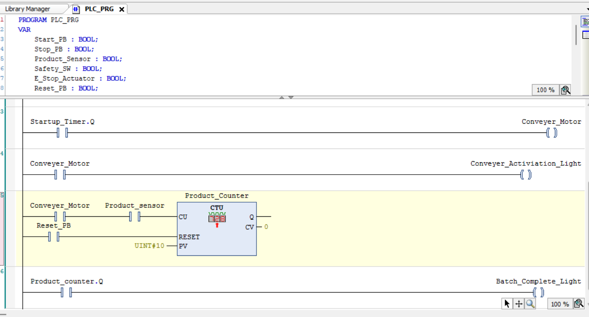

# PLC Project 1 – Conveyer Belt Project

## Overview

This project is the first step in my PLC programming journey using CODESYS.

The goal is to understand the fundamentals of PLC programming by creating a simple program where pressing a push button energizes an output to turn on a light.

---

## Skills Practiced

- PLC Fundamentals
- Ladder Logic
- Normally Open Contact
- Output Coil
- PLC Scan Cycle

---

## Learning Objectives

- Understand how PLC inputs and outputs work
- Learn how Ladder Logic executes
- Create my first functioning PLC program
- Document my progress professionally

---

## Future Improvements

- Add a Stop button (complete)
- Add a latch circuit (complete)
- Add timers (complete)
- Convert the project to a Factory I/O simulation (complete)

---

## PLC Project 1 – Conveyer Belt Project

Objective

Design a ladder logic program in CODESYS that controls a light using a Start push button, Stop push button, Safety Switch, and a 5-second ON-delay timer. The program should use an internal latch so the Start button only needs to be pressed once.

Components Used

Inputs

- Start Push Button (NO)
- Stop Push Button (NC)
- Safety Switch (NO)

Internal Memory

- Run_Latch

- Function Block

- TON (On Delay Timer)

Output

- Light

## Program Logic

1. Pressing the Start button sets the Run_Latch memory bit.
2. Run_Latch remains TRUE after the Start button is released.
3. If the Stop button is pressed, Run_Latch resets.
4. When Run_Latch and Safety Switch are TRUE, the TON timer begins counting.
5. After 5 seconds, the timer's Q output becomes TRUE.
6. The Light output turns ON.

## What I learned

- Difference between Normally Open and Normally Closed contacts.
- Series contacts create AND logic.
- Parallel branches create OR logic.
- TON timers delay an output instead of immediately energizing it.
- nternal memory bits are used instead of output coils for latching.
- Ladder logic executes from left to right and the PLC scans continuously.

## Problems Encountered

- Problem 1

I initially didn't understand how to create a second contact in series.

Solution

Learned how ladder logic is constructed and how contacts are placed one after another.

- Problem 2

I didn't understand how TON worked.

I originally thought the timer directly delayed electricity.

Solution

Learned that TON waits until its preset time has elapsed before its Q output becomes TRUE.

- Problem 3

I didn't understand why the Stop button should use a Normally Closed contact.

Solution

Learned that industrial stop buttons are normally closed because the circuit remains complete until the button is pressed.

## Reflection

This project introduced me to the fundamentals of PLC programming using ladder logic. At first, I focused mainly on making the circuit work, but I later realized that a working program is not always the best design. My original solution latched the Light output directly, which required holding the Start button until the timer finished. After redesigning the program with an internal Run_Latch memory bit, I better understood how industrial PLC programs separate machine state, timing, and outputs into multiple rungs. This project also improved my understanding of timers, parallel branches, normally closed contacts, and troubleshooting ladder logic. Going forward, I want to build programs that are not only functional but also easier to maintain and troubleshoot.

# Version 2 – Product Counting System
## Objective

Design and program a PLC-controlled conveyor belt system that safely starts after a five-second delay, counts products using a simulated sensor, and indicates when a batch of ten products has been completed.

## Components Used

Inputs

- Start_PB – Starts the conveyor system.
- Stop_PB – Stops the conveyor system.
- Safety_SW – Prevents the conveyor from starting unless the safety switch is active.
- Product_Sensor – Detects products moving past the sensor and increments the counter.
- Reset_PB – Resets the product counter to begin a new batch.

Internal Memory / Function Blocks

- Conveyor_Run_Latch (BOOL) – Keeps the conveyor running after the Start button is released.
- Startup_Timer (TON) – Delays conveyor startup by 5 seconds.
- Product_Counter (CTU) – Counts products detected by the sensor until the preset value is reached.

Outputs
- Conveyor_Motor – Runs the conveyor after the startup delay has elapsed.
- Batch_Complete_Light – Turns ON after ten products have been counted.

## Program Logic

1. After the timer finishes, the conveyor motor turns ON.
2. As products pass the Product_Sensor, the CTU counter increments by one.
3. When the counter reaches the preset value of 10, the Batch_Complete_Light turns ON.
4. The operator presses Reset_PB to clear the counter and begin a new production batch.

## What I Learned

- How to create and use a TON (On-Delay Timer).
- How to implement a CTU (Count Up Counter).
- The difference between a contact and a coil in ladder logic.
- ow PLC function blocks store information internally.
- The purpose of PV (Preset Value), CV (Current Value), and Q in a counter.
- Why internal variables such as Conveyor_Run_Latch are useful.
- How multiple rungs work together to create an industrial control sequence.

## Problems Encountered

- Problem 1 – Understanding Contacts vs. Coils

At first, I thought the conveyor motor should always be represented as a coil. I later learned that the coil writes to the variable, while contacts read the current state of that same variable elsewhere in the program.

- Problem 2 – Counter Data Type

Initially, I entered the preset value as a regular number. I learned that the CTU function block expects the correct data type (such as UINT) for the preset value.

- Problem 3 – Counter Placement

I was unsure whether the counter should be placed within the timer logic or on its own rung. I learned that each rung should have a single responsibility, making the program easier to read and troubleshoot.

## Reflection

This project helped me understand how timers and counters are used together in industrial automation. Instead of creating isolated examples, I expanded my original delayed-start project into a conveyor belt control system, making the program more realistic. I also developed a better understanding of PLC scan logic, function blocks, and the importance of organizing ladder logic into clear, modular rungs. In the next version of the project, I plan to improve operator feedback by adding status indicators and additional safety features.

## Version 3 - Industrial Sensor Simulation 

### Objective
Simulate an inductive proximity sensor detecting a metal object on the conveyor.

### Inputs
- Metal_Part_Detected (BOOL)

### Outputs
- Part_Detected_Light

### Program Logic
When the conveyor motor is running and a metal part is detected, the green indicator light turns on to show that the object has been successfully detected.

### Why This Is Used
In industry, proximity sensors automatically detect parts without physical contact. The PLC uses this information to make decisions such as counting products, stopping conveyors, or activating other equipment.

### What I Learned
- How a digital sensor acts as a PLC input.
- How multiple conditions can be combined using series contacts.